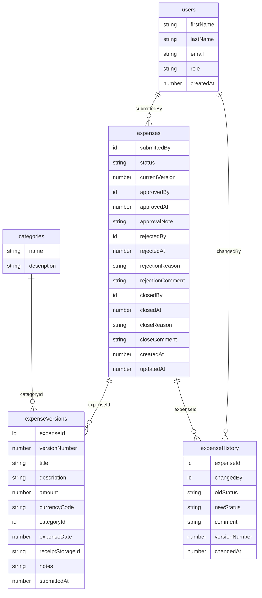

# Architecture — Internal Expense Tracker

This document describes the system architecture, data model, state machine, and key design decisions for engineers joining or extending the project.

See [CLAUDE.md](../CLAUDE.md) for the full requirements specification and business rules.

---

## System Overview

```
┌─────────────────────────────┐
│         Browser             │
│   Next.js React App         │
│   (App Router, shadcn/ui)   │
└──────────────┬──────────────┘
               │ Real-time subscriptions (WebSocket)
               │ Mutations (HTTP)
               ▼
┌─────────────────────────────┐
│         Convex Cloud        │
│  ┌─────────────────────┐    │
│  │   Server Functions  │    │
│  │  queries/mutations  │    │
│  └──────────┬──────────┘    │
│             │               │
│  ┌──────────▼──────────┐    │
│  │   Convex Database   │    │
│  │ (document store)    │    │
│  └─────────────────────┘    │
│  ┌─────────────────────┐    │
│  │   Convex Storage    │    │
│  │ (receipt files)     │    │
│  └─────────────────────┘    │
└─────────────────────────────┘
```

### Why Convex?

- **Real-time by default** — queries are reactive subscriptions; the UI updates automatically when data changes without polling
- **Atomic mutations** — all state transitions happen in a single transaction; partial updates are impossible
- **Built-in auth** — Convex Auth handles JWT signing, session management, and token rotation
- **File storage** — receipt uploads are stored natively without a separate S3/CDN setup
- **TypeScript end-to-end** — schema, functions, and generated types are all TypeScript

---

## Authentication Flow

```
1. User submits login form
2. Convex Auth validates email/password
3. JWT signed with JWKS private key (stored in Convex dashboard env vars)
4. Session token stored in browser (httpOnly cookie via Convex Auth)
5. Every query/mutation calls getAuthenticatedUser(ctx) → throws if no session
6. Role read from users table → hasPermission() checked before any action
```

Auth is configured in [convex/auth.config.ts](../convex/auth.config.ts) and [convex/auth.ts](../convex/auth.ts).

Key env vars (set in Convex dashboard, not Vercel):
- `JWT_PRIVATE_KEY` — signs tokens
- `JWKS` — public key set for verification
- `SITE_URL` — used by auth for redirect validation

---

## Status Machine

```
Draft ──[submitExpense]──► Submitted ──[openForReview]──► Under Review
                               │                               │
                        [withdrawExpense]            ┌─────────┼─────────┐
                               │                [approve] [reject]  [close]
                               ▼                    │       │         │
                           Withdrawn            Approved Rejected   Closed
                          (terminal)           (terminal)  │      (terminal)
                                                      [editRejected]
                                                           │
                                                         Draft
                                                           │
                                                   [resubmitExpense]
                                                           │
                                                       Submitted
                                                      (v2, v3, …)
```

Mutation names in brackets map directly to functions in [convex/expenseMutations.ts](../convex/expenseMutations.ts) and [convex/expenseManagerMutations.ts](../convex/expenseManagerMutations.ts).

**Terminal statuses:** `Approved`, `Closed`, `Withdrawn` — no further transitions.

Every transition writes an immutable row to `expenseHistory` via `writeHistory()` ([convex/expenseHelpers.ts](../convex/expenseHelpers.ts)).

---

## Data Model



---

## Key Design Decisions

### Append-only history and versions

`expenseHistory` and `expenseVersions` are **never updated or deleted**. Every status change appends a new history row. Every submit/resubmit creates a new version snapshot. This provides a complete, immutable audit trail.

Version 0 (`versionNumber: 0`) is the working draft — it is updated freely while the expense is in Draft status. On submission, a new version (`versionNumber: 1, 2, 3, …`) is created atomically.

### Shared Zod schemas

All input validation is defined once in [lib/validators.ts](../lib/validators.ts) and shared between the React forms (client-side UX) and Convex server functions (authoritative validation). Duplication is explicitly forbidden — if you add a field, add it to the shared schema.

### Role-to-permission mapping

Permissions are defined in [lib/permissions.ts](../lib/permissions.ts) as a mapping from role to permission list. Server functions call `hasPermission(role, permission)` before any sensitive operation. The pattern is:

```ts
if (!hasPermission(user.role as Role, "expense:approve")) {
  throw new ConvexError("You do not have permission to approve expenses");
}
```

Never use `if (role === "manager")` directly in business logic. Always go through `hasPermission()`.

### Manager cannot act on own expense

Every manager mutation checks `expense.submittedBy === user._id` and throws if true. The UI also hides action buttons, but the server-side check is authoritative.

### Real-time UI

Convex queries are React subscriptions — they push updates to the UI automatically. This means the manager dashboard and employee dashboard both update in real time when any expense changes without any polling or manual refresh.

---

## Project Structure

```
app/                    Next.js App Router pages
  (auth)/              Login & register (unauthenticated)
  (dashboard)/         Authenticated shell
    page.tsx           Employee dashboard
    manager/page.tsx   Manager dashboard

components/
  ui/                  shadcn/ui re-exports (Button, Badge, Dialog, etc.)
  expenses/            Employee-facing components
  manager/             Manager-facing components

convex/
  schema.ts            Database schema and indexes
  auth.ts              Convex Auth setup
  expenseMutations.ts  Employee mutations
  expenseManagerMutations.ts  Manager mutations
  expenseQueries.ts    All queries
  expenseHelpers.ts    writeHistory(), getAuthenticatedUser()
  files.ts             generateUploadUrl, getFileUrl

lib/
  constants.ts         Status enums, rejection/close reasons, currencies
  permissions.ts       Role → permission mapping
  validators.ts        Shared Zod schemas
  utils.ts             Utility functions (cn, formatCurrency, etc.)

tests/
  unit/                Vitest unit tests (validators, permissions, constants)
  integration/         Vitest integration tests (state machine, versioning, audit)
  e2e/                 Playwright end-to-end tests
```
